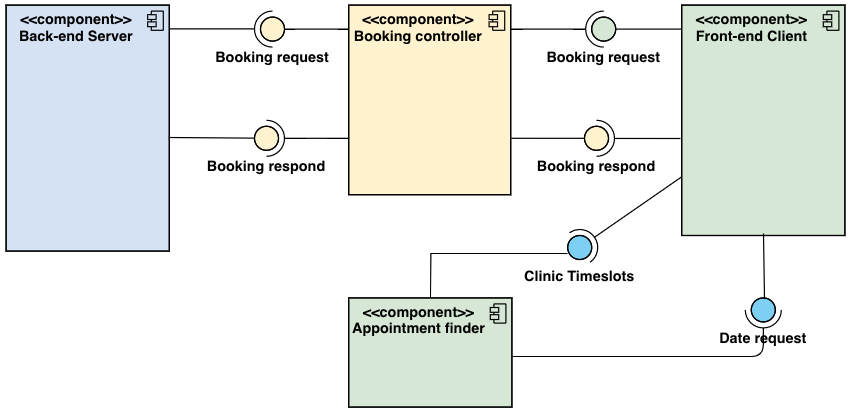
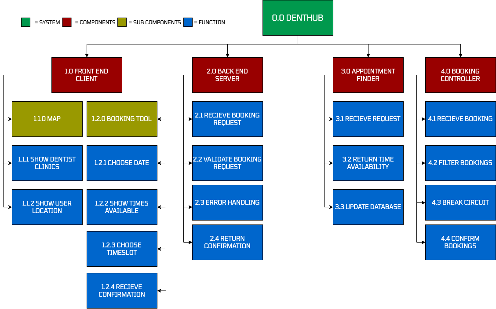

# Documentation

# What we are making

##### This project will consist of a dentist registry booking system. Users will be able to browse and filter appointment to fit their medical needs. The user interface will be found inside the client branch. 

##### The interface is a simple web application, where users will be able to navigate a map marked with available dentist clinics. Upon clicking on of these clinics a booking form with a calender will appear, and let users fill in necessary information to ultimately book their appointment. Bookings are successful if the client recieves a booking confirmation. 
 

# How we are making it

#### The project will consist of multiple technologies, which will work together to form a distributed system. The technologies are the following. 
- Node.js Express framework for server implementation written in JavaScript 
- Client written in Node.js with the Vue framework to achieve a reactive user interface.
- Local Mosquitto MQTT broker to handle messages sent and recieved by both the client and server.
- MongoDB as the persistence layer for all these components. Database schema will be created through the Mongoose framework. 
- Leaflet API as our Map service.

## Project managment brief
We chose to use the Scrum process for our project, with a rotating product owner and scrum master. The main structuring of the project journey took place on Trello(link), with cards that determined the different stages of our continuous development, e.g done, to-do etc. 

The team also decided on two standup meetings per week(Monday and Friday) and to use the milestones received from the assignment briefing as each sprint. The meetings were structured so that a specific sprint scrum master went through everyone's work progress and checked with the product owner whether the requirements were being fulfilled and met. Depending on the stage of the project each meeting would either be a sprint planning, sprint retrospective or sprint review. 

To instill a sense of accountability and responsibility to ourselves and each other we had a team contract written up and signed by the first sprint meeting. The contract made sure everyone would adhere to the given schedule and the structure we decided was fitting. This was also beneficial when decisions regarding scope and design had to be made, as the contract gave a member responsibility as the product owner each sprint. So they had the final say when there were conflicting ideas, or to their best abilities reach a compromise between the various parties. 

## Strategy decisions and design
The strategy and design decisions were mostly derived and considered from familiarity and team expertise. We choose familiar software designs fitting to our project, while challenging ourselves with new technologies. Being a smaller team in terms of the amount of members, we didn’t think too much unknown technologies would help us finish this project and overall be beneficial. So our strategy became to, for the most part, use known technologies to meet our requirements and avoid partaking in activity spaces, where we couldn't fully know it could solve a given problem. E.g using vue as the front-end framework and choosing the database technology. 

Our main ASRs were definitely the requirements from the assignment briefing and being honest we think it to some extent was enough to get a good enough conceptualization of our architecture, especially when considering our strategy approach, which was being conservative in brainstorming and thinking outside our already established frameworks. MQTT communication was obviously a major requirement, however, it didn't impact our decisions as much as we thought it would. 

What revealed to be some big ASR was the feedback we received from the TA and how we had to configure our component structure to reach the passing criteria. We at first thought a simple client/server architecture was enough to satisfy the project requirements. Upon receiving this feedback we had to restructure the information/data flow between the different components and add intermediate components between the server and client, for specific dedicated tasks, validation of the incoming requests, and confirmation of bookings.

## Architecture, styles, and tactics
The conceptual design of our distributed system consists of four independent components. They are the following: the Front-end client, Booking-Controller, Appointment-finder, and the Back-end server. The main components are the server and client, where most of the processing takes place. The client is responsible for all interface objectives and serves as a representation layer for the end-user. 

The server handles and validates the information requested from the client and handles the persistent data needed for our system. The styles are then also quite evident. The Client/server architecture style was a major influence in our design, even though our requirements weren’t quite fitting to this style we still had a similar design concept.Given that the major communication between components had to be with the MQTT protocol and not HTTP requests we couldn't instill a traditional Client/Server style. However, to not make having a server redundant we implemented a few endpoints for the client to receive http request through. This was mostly information that needed to be available for presentation when the web app gets loaded. 

Pub/sub was also a major architecture style used and implemented within all components. The messaging system through MQTT worked as an event activator for various actions, e.g to validate a request or load time slots for a given date etc. We tried to minimize the amount of topics used for simplicity sake and minimize the load on the broker itself. 

This can also be seen in the components, e.g the appointment-finder is essentially a listener for one topic and only has one responsibility. This was our tactic as well, by separating the different concerns of the system and delegate them to appropriate components we achieved a smooth communication flow between components. This made the development phase easier as well as the processing within each component had no dependencies outside that component. 

## Conceptualization

### Component Diagram

### Functional Decomposition Model

### Project management

See our wiki: https://git.chalmers.se/courses/dit355/test-teams-formation/team-14/documentation/-/wikis/home
